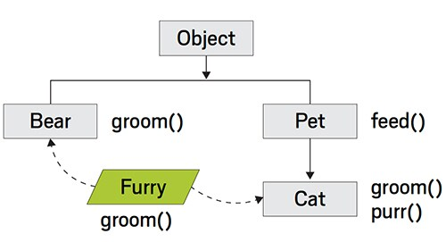

> [원본 링크](https://blogs.oracle.com/javamagazine/post/mastering-the-mechanics-of-java-method-invocation)
### 자바 메소드 호출의 기술을 숙달하기

특별한 바이트코드는 메소드 호출을 특히 효율적으로 만듭니다. 이들이 어떻게 작동하는지 알면 JVM이 코드를 실행하는 방식을 알 수 있습니다.

[Java Magazine는 2017년에 출판된 Ben Evans의 이 기사를 재게시하는 것을 기쁘게 생각합니다. —편집자]

이 기사는 JVM이 Java 8 및 Java 9에서 메소드를 실행하는 방법을 설명합니다. [그리고 이후 버전에서도 해당됩니다. —편집자] 이는 JVM의 내부에 대한 기본적인 주제로, JVM의 JIT(Just-In-Time) 컴파일러를 이해하거나 응용 프로그램의 실행을 조정하고자 하는 모든 사람에게 필수적인 배경 지식입니다.

시작하려면 다음과 같은 간단한 Java 코드를 살펴보세요:

```java
long time = System.currentTimeMillis();
HashMap<String, String> hm = new HashMap<>();
hm.put("now", "bar");
Map<String, String> m = hm;
m.put("foo", "baz");
```

이 코드에 대해 Java 컴파일러가 생성하는 바이트코드를 보려면 다음과 같이 javap 도구를 -c 스위치와 함께 사용하여 디컴파일된 코드를 표시할 수 있습니다(들여쓰기된 줄은 이전 줄에서 계속됩니다):
```
javap -c ExampleClass
```
위의 명령어는 ExampleClass라는 클래스의 바이트코드를 출력합니다. ExampleClass는 실제 클래스 이름으로 대체되어야 합니다.

```bytecode
0: invokestatic #2 // Method
                                java/lang/System.currentTimeMillis:()J
3: lstore_1
4: new #3 // class java/util/HashMap
7: dup
8: invokespecial #4 // Method java/util/HashMap."<init>":()V
11: astore_3
12: aload_3
13: ldc #5 // String now
15: ldc #6 // String bar
17: invokevirtual #7 // Method java/util/HashMap.put:
                           (Ljava/lang/Object; Ljava/lang/Object;)
                           Ljava/lang/Object;
20: pop
21: aload_3
22: astore 4
24: aload 4
26: ldc #8 // String foo
28: ldc #9 // String baz
30: invokeinterface #10, 3 // InterfaceMethod java/util/Map.put:
                            (Ljava/lang/Object;Ljava/lang/Object;)
                            Ljava/lang/Object;
35: pop
```
JVM 수준에서 코드를 살펴보는 데 처음 접하는 Java 프로그래머들은 아마도 놀랄 것입니다. Java 메소드 호출은 실제로 invokestatic, invokevirtual 또는 invokeinterface와 같은 형태의 여러 가지 바이트코드 중 하나로 변환됩니다.
> invokestatic, invokespecial, invokevirtual, invokeinterface 로 prefix 붙어있는 것들.

자세히 살펴보겠습니다. 디컴파일된 코드의 첫 부분을 살펴보겠습니다.
```bytecode
0: invokestatic #2 // Method java/lang/System.currentTimeMillis:()J
3: lstore_1
```
System.currentTimeMillis()에 대한 정적 호출은 바이트코드에서 위치 0에 나타나는 invokestatic 옵코드로 변환됩니다. 이 메소드는 매개변수를 사용하지 않으므로 호출 전에 평가 스택에 로드할 필요가 없습니다.

다음으로, 바이트 스트림에는 00 02라는 두 개의 바이트가 나타납니다. 이들은 16비트 숫자(#2인 경우)로 결합되어 클래스 파일 내의 상수 풀(constant pool)이라고 불리는 테이블에서 오프셋으로 사용됩니다. 모든 상수 풀 인덱스는 16비트이므로, 옵코드가 풀 내 항목을 참조해야 할 때 항상 두 개의 연속된 바이트가 있으며 이들은 항목의 오프셋을 인코딩합니다.

디컴파일러는 도움이 되도록 주석을 추가하여 오프셋 #2가 어떤 메소드에 해당하는지 알려줍니다. 예상대로, 이 경우에는 System.currentTimeMillis() 메소드입니다. 디컴파일된 출력에서 javap은 호출된 메소드의 이름을 보여주고, 메소드가 받는 매개변수의 타입(괄호 안)과 그 다음으로 메소드의 반환 타입을 표시합니다.

호출이 반환되면 호출 결과는 스택에 저장되며, 오프셋 3에서는 인자가 없는 단일 옵코드인 lstore_1이 나타납니다. 이는 반환 값을 long 타입의 로컬 변수에 저장합니다.

인간 독자는 물론이고, Java 컴파일러의 설계 목표 중 하나는 논리적으로 의미가 있는지 여부와 관계없이 Java 소스 코드의 내용을 최대한 충실히 나타내는 것입니다. 따라서 System.currentTimeMillis()의 반환 값은 프로그램에서 이후에 사용되지 않더라도 저장됩니다.

이제 디컴파일된 코드의 다음 청크를 살펴보십시오.
```bytecode
4: new #3 // class java/util/HashMap
7: dup
8: invokespecial #4 // Method java/util/HashMap."<init>":()V
11: astore_3
12: aload_3
13: ldc #5 // String now
15: ldc #6 // String bar
17: invokevirtual #7 // Method java/util/HashMap.put:
                                     (Ljava/lang/Object;Ljava/lang/Object;)
                                     Ljava/lang/Object;
20: pop
```
바이트코드 4부터 10까지는 지시문 11에서 해당 HashMap 인스턴스의 복사본을 로컬 변수에 저장하기 전에 새로운 HashMap 인스턴스를 생성합니다. 그 다음, 지시문 12부터 16까지는 HashMap 객체와 put() 메서드 호출에 필요한 인수들을 스택에 설정합니다. 실제로 put() 메서드를 호출하는 작업은 지시문 17부터 19까지 수행됩니다.

이번에 사용된 invoke opcode는 invokevirtual입니다. 이는 정적 호출과 다릅니다. 정적 호출은 메서드가 호출되는 인스턴스를 가지지 않습니다. 이러한 인스턴스를 때로는 수신 객체(receiver object)라고도 합니다. (바이트코드에서 인스턴스 호출은 수신자와 모든 호출 인수를 평가 스택에 배치한 다음 invoke 지시문을 발행하여 설정해야 합니다.) 이 경우, put() 메서드의 반환 값은 사용되지 않으므로 지시문 20에서 해당 값을 버립니다.

21부터 25까지의 바이트 시퀀스는 처음에 보면 다소 이상해 보일 수 있습니다.

```bytecode
21: aload_3
22: astore 4
24: aload 4
26: ldc #8 // String foo
28: ldc #9 // String baz
30: invokeinterface #10, 3 // InterfaceMethod java/util/Map.put:
                                       (Ljava/lang/Object;Ljava/lang/Object;)
                                       Ljava/lang/Object;
35: pop
```

바이트코드 4에서 생성되고 지시문 11에서 로컬 변수 3에 저장된 HashMap 인스턴스가 이제 다시 스택에 로드되고, 그리고 참조의 복사본이 로컬 변수 4에 저장됩니다. 이 과정은 스택에서 해당 인스턴스를 제거하므로 사용하기 전에 (변수 4에서) 다시 로드해야 합니다.

이러한 섞임(shuffling)은 원래의 Java 코드에서 추가적인 로컬 변수(Map 타입으로 선언된)가 생성되기 때문입니다. 이 추가 변수는 항상 원래 변수와 동일한 객체를 참조하지만 생성됩니다. 이는 바이트코드가 가능한 한 원본 소스 코드에 가깝게 유지되도록 하는 또 다른 예입니다. Java가 취하는 "덤 바이트코드(dumb bytecode)" 접근 방식의 주요 이유 중 하나는 JVM의 JIT 컴파일러에 대한 간단한 입력 형식을 제공하기 위함입니다.

스택과 변수의 섞임(shuffling) 이후, Map에 넣을 값들이 지시문 26부터 29까지 로드됩니다. 이제 스택이 수신자와 인수로 준비되었으므로 put() 호출은 지시문 30에서 디스패치됩니다. 이번에는 invokeinterface라는 opcode가 사용됩니다. (똑같은 메서드를 호출하더라도) 한 번 더, put()의 반환 값은 지시문 35에서 pop을 통해 버려집니다.

스택 및 변수를 섞은 후, 맵에 넣을 값은 26번에서 29번 지시문에서 로드됩니다. 이제 스택은 수신자와 인수로 준비되었으므로 put()을 호출하는 것은 30번 지시문에서 수행됩니다. 이번에는 같은 메서드를 호출하더라도 opcode는 invokeinterface입니다. 다시 한 번 put()에서의 반환값은 35번 지시문에서 팝을 통해 버려집니다.

지금까지 본 바로는 Java 컴파일러의 호출 문맥에 따라 invokestatic, invokevirtual 또는 invokeinterface가 생성될 수 있음을 알 수 있습니다.

### 메서드 호출을 위한 JVM 바이트코드

모든 다섯 개의 JVM 바이트코드를 살펴보겠습니다. 각 경우에 대해 b0와 b1 바이트는 c1으로 표시된 상수 풀 오프셋으로 결합됩니다.

1. `invokestatic`: 정적 메서드를 호출하는 바이트코드입니다. 상수 풀에서 해당 메서드의 심볼릭 레퍼런스(메서드 이름, 메서드 설명자)의 상수 풀 인덱스가 c1로 표시됩니다.
2. `invokevirtual`: 인스턴스 메서드를 호출하는 바이트코드입니다. c1은 해당 메서드의 심볼릭 레퍼런스(메서드 이름, 메서드 설명자)의 상수 풀 인덱스를 가리킵니다.
3. `invokeinterface`: 인터페이스 메서드를 호출하는 바이트코드입니다. c1은 해당 메서드의 심볼릭 레퍼런스(메서드 이름, 메서드 설명자)의 상수 풀 인덱스를 나타냅니다.
4. `invokespecial`: 주로 생성자 호출 또는 private 메서드 호출에 사용되는 바이트코드입니다. c1은 호출하려는 메서드의 심볼릭 레퍼런스(메서드 이름, 메서드 설명자)의 상수 풀 인덱스를 가리킵니다.
5. `invokedynamic`: Java 7 이후에 추가된 동적 호출에 사용되는 바이트코드입니다. c1은 동적 메서드 호출에 필요한 정보를 가리킵니다.

#### 표 1. 메서드 호출을 위한 JVM 바이트코드

일부 Java 코드를 작성하고 javap를 사용하여 해당 코드를 역어셈블해 각 바이트코드 형태가 어떤 상황에서 생성되는지 확인하는 것은 유용한 연습일 수 있습니다.

가장 일반적인 메서드 호출 유형은 "invokevirtual"로, 가상 디스패치를 나타냅니다. 가상 디스패치라는 용어는 호출할 정확한 메서드가 실행 시간에 결정된다는 것을 의미합니다. 이를 이해하기 위해서는 실행 중인 애플리케이션 내에 있는 각 클래스가 해당 유형에 해당하는 메타데이터를 보유하는 JVM 내의 메모리 영역이 있다는 것을 알아야 합니다. 이 영역은 "klass"라고 불리며 (적어도 Java HotSpot VM에서는) 해당 유형에 대한 정보를 나타내는 JVM의 표현으로 생각할 수 있습니다.

Java 7 이전에는 "klass" 메타데이터가 "permgen"이라고 불리는 Java 힙의 한 영역에 저장되었습니다. Java 힙 내의 객체는 객체 헤더(우리말로 "oop"라고 부름)를 가져야 하기 때문에 "klasses"는 "klassOops"로 알려져 있었습니다. 그러나 Java 8 및 Java 9에서는 "klass" 메타데이터가 Java 힙에서 네이티브 힙으로 이동되었으므로 객체 헤더가 더 이상 필요하지 않습니다. "klass"에서 일부 정보는 Java 프로그래머에게 해당 유형에 해당하는 Class<?> 객체를 통해 사용 가능하지만, 이들은 별개의 개념입니다.

"klass"의 가장 중요한 영역 중 하나는 "vtable"입니다. 이 영역은 사실상 유형에서 정의된 메서드의 구현을 가리키는 함수 포인터 테이블입니다. "invokevirtual"을 통해 인스턴스 메서드를 호출할 때, JVM은 정확히 어떤 코드를 실행해야 하는지 확인하기 위해 "vtable"을 참고합니다. 만약 "klass"에 메서드에 대한 정의가 없다면, JVM은 해당 슈퍼클래스에 해당하는 "klass"를 가리키는 포인터를 따라가 다시 시도합니다.

이 과정은 JVM에서 메서드 오버라이딩의 기초입니다. 이 프로세스를 효율적으로 만들기 위해 vtable은 특정한 방식으로 배치됩니다. 각 "klass"는 vtable을 배치하여 첫 번째 나타나는 메서드가 부모 유형에서 정의한 메서드입니다. 이러한 메서드는 부모 유형이 사용한 정확한 순서대로 배치됩니다. 이 유형에 새롭게 추가되거나 부모 클래스에서 선언되지 않은 메서드는 vtable의 끝에 배치됩니다.

결과적으로, 하위 클래스가 메서드를 오버라이드하면 해당 메서드는 오버라이드되는 구현과 동일한 오프셋에 위치합니다. 이로써 오버라이드된 메서드를 찾는 것은 완전히 단순해집니다. 왜냐하면 vtable에서의 그들의 오프셋은 그들의 부모의 오프셋과 동일하기 때문입니다.

#### Figure 1은 Pet, Cat, Bear 클래스 및 인터페이스 Furry로 정의된 예제를 보여줍니다.
        
그림 1

이러한 클래스의 vtable은 Java 7에서 그림 2에 표시된대로 배치됩니다. 이 그림은 permgen 내의 Java 7 레이아웃을 보여주므로 klassOops를 참조하고 객체 헤더의 두 개 단어가 포함되어 있습니다 (그림에서 m과 kk로 표시됨). 이전에 설명한대로 이러한 항목들은 Java 8 및 Java 9에는 존재하지 않을 것이지만 다이어그램의 나머지 부분은 동일합니다.

        
그림 2

만약 Cat::feed를 호출한다면, JVM은 Cat 클래스에서 오버라이드를 찾지 못하고 대신 Pet 클래스의 klass로 포인터를 따를 것입니다. 이 klass에는 feed()를 위한 구현이 있으므로 이 코드가 호출됩니다. 이 vtable 구조는 Java에서 클래스의 단일 상속만 구현하기 때문에 잘 작동합니다. 이것은 어떤 유형의 직접적인 슈퍼클래스가 하나뿐이기 때문입니다 (Object는 슈퍼클래스가 없는 예외입니다).

"invokeinterface"의 경우 상황은 조금 더 복잡합니다. 예를 들어, groom() 메서드는 Furry의 모든 구현에서 항상 동일한 위치에 나타나지 않을 수 있습니다. Cat::groom과 Bear::groom의 서로 다른 오프셋은 이들의 클래스 상속 계층이 다르기 때문입니다. 결과적으로 컴파일 시간에 인터페이스 유형만 알려진 객체에서 메서드가 호출될 때 추가적인 조회가 필요합니다.

인터페이스 호출을 조회하는 데 약간 더 많은 작업이 필요할 수 있지만, 인터페이스 사용을 피하려고 하여 마이크로 최적화를 시도해서는 안 됩니다. JVM (Java 가상 머신)은 JIT (Just-In-Time) 컴파일러를 갖고 있으며, 이 컴파일러는 코드 실행을 동적으로 최적화하는 데 사용됩니다. 대부분의 경우, 인터페이스를 사용하거나 사용하지 않는 경우의 성능 차이는 무시할 수준이거나 전혀 없을 것입니다. 따라서 성능을 마이크로 최적화하려는 대신, 적절한 디자인과 추상화를 위해 필요한 대로 인터페이스를 사용하는 깔끔하고 유지 관리 가능한 코드 작성에 중점을 두어야 합니다.

#### 예제
```java
Cat tom = new Cat();
Bear pooh = new Bear();
Furry f;
tom.groom();
pooh.groom();
f = tom;
f.groom();
f = pooh;
f.groom();
```
이 코드를 바이트코드로 변환.
```bytecode
0: new #2 // class scratch/Cat
3: dup
4: invokespecial #3 // Method scratch/Cat."<init>":()V
7: astore_1
8: new #4 // class scratch/Bear
11: dup
12: invokespecial #5 // Method scratch/Bear."<init>":()V
15: astore_2
16: aload_1
17: invokevirtual #6 // Method scratch/Cat.groom:()V
20: aload_2
21: invokevirtual #7 // Method scratch/Bear.groom:()V
24: aload_1
25: astore_3
26: aload_3
27: invokeinterface #8, 1 // InterfaceMethod scratch/Furry.groom:()V
32: aload_2
33: astore_3
34: aload_3
35: invokeinterface #8, 1 // InterfaceMethod scratch/Furry.groom:()V
```

27번과 35번 호출은 같아 보이지만, 실제로는 서로 다른 메서드를 호출합니다. 27번 호출은 Cat::groom를 호출하며, 35번 호출은 Bear::groom를 호출합니다.

invokevirtual과 invokeinterface에 대한 이해를 바탕으로 invokespecial의 동작을 이해하기 쉬워집니다. invokespecial로 메서드가 호출되면 가상 조회가 수행되지 않습니다. 대신 JVM은 요청한 메서드를 vtable에서 정확한 위치에서만 찾습니다. 이것은 invokespecial이 세 가지 경우에 사용됨을 의미합니다: private 메서드, 슈퍼클래스 메서드 호출 및 생성자 본문 호출 (바이트코드에서는 <init>이라는 메서드로 변환됨). 이 세 가지 경우 모두 가상 조회와 오버라이딩 가능성이 명시적으로 제외되어야 합니다.

### 마지막으로
언급해야 할 또 하나의 특수한 경우가 있습니다. 바로 final 메서드의 경우입니다. 처음 봤을 때는 final 메서드를 호출하는 것도 invokespecial 명령어로 변환될 것으로 생각될 수 있습니다. 그러나 Java 언어 사양 (Java Language Specification) 섹션 13.4.17에는 이 경우에 대한 내용이 있습니다: "final로 선언된 메서드를 더 이상 final로 선언하지 않도록 변경해도 기존 이진 파일과의 호환성이 깨지지 않습니다."

가령 컴파일러가 final 메서드를 호출하는 호출을 invokespecial로 컴파일했다고 가정해봅시다. 그런 다음 메서드가 더 이상 final로 선언되지 않도록 변경된다면 이 메서드는 하위 클래스에서 오버라이드될 수 있게 됩니다. 이제 하위 클래스의 인스턴스가 컴파일된 코드로 전달된다고 가정해봅시다. invokespecial이 실행되고 나면 잘못된 메서드 구현이 호출됩니다. 이것은 Java의 객체 지향 규칙을 위반하게 됩니다 (엄밀히 말하면, Liskov 대체 원칙을 위반합니다).

이러한 이유로 final 메서드를 호출하는 경우 invokevirtual 명령어로 컴파일해야 합니다. 실제로 Java HotSpot VM은 final 메서드를 감지하고 매우 효율적으로 실행할 수 있는 최적화를 포함하고 있습니다.